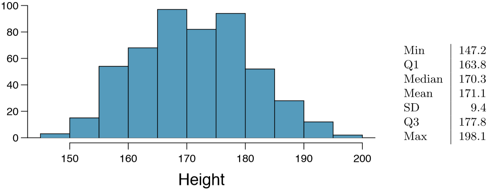
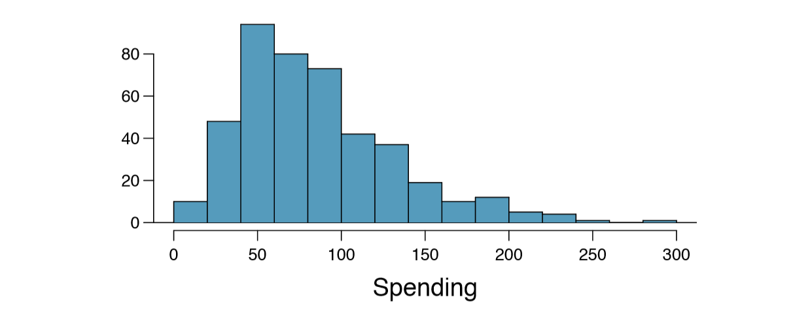
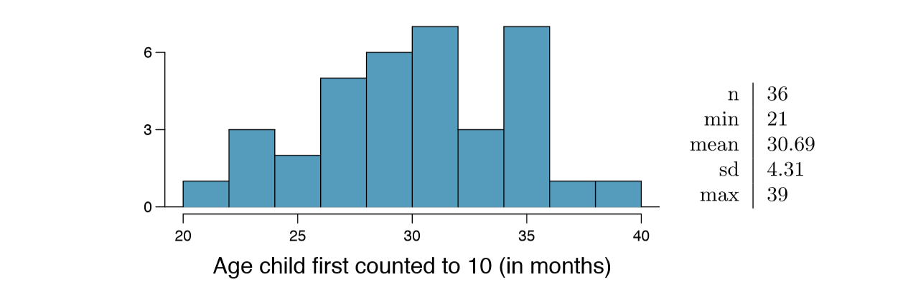
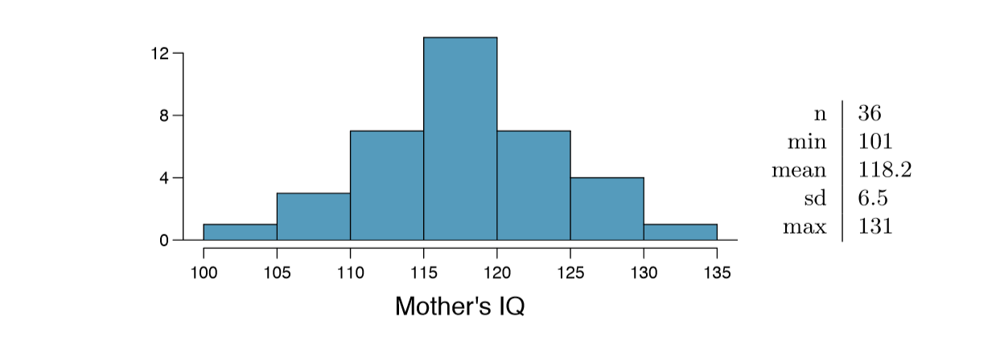

##Graded Questions

Q 1: (4.4) Heights of adults. Researchers studying anthropometry collected body girth measurements and skeletal diameter measurements, as well as age, weight, height and gender, for 507 physically active individuals. The histogram below shows the sample distribution of heights in centimeters.



  (a) What is the point estimate for the average height of active individuals? What about the median? 
  (b) What is the point estimate for the standard deviation of the heights of active individuals? What about the IQR?
  (c) Is a person who is 1m 80cm (180 cm) tall considered unusually tall? And is a person who is 1m 55cm (155cm) considered unusually short? Explain your reasoning. 
  (d) The researchers take another random sample of physically active individuals. Would you expect the mean and the standard deviation of this new sample to be the ones given above? Explain your reasoning. 
  (e) The sample means obtained are point estimates for the mean height of all active individuals, if the sample of individuals is equivalent to a simple random sample. What measure do we use to quantify the variability of such an estimate (Hint: recall that $SD~\bar{x}~ = \sigma / \sqrt{n}$ = pn)? Compute this quantity using the data from the original sample under the condition that the data are a simple random sample.

**_A:_**
  **_(a) Point estimate for the average height is $\mu = 171.1$. Median is 170.3._**
  
  **_(b) Point estimate for the standard deviation of the heights $\sigma = 9.4$. IQR = Q3 - Q1 = `r 177.8 - 163.8`_**
  
  **_(c) Z score = $\frac{(x - \mu)}{\sigma}$, Z~180~ = `r round((180 - 171.1)/9.4,2)` and Z~155~ = `r round((155 - 171.1)/9.4,2)`. According 68-95-99.7 rule, 95% percentile z score is $\pm 1.96$. Also range for 2 standard deviations from mean is (`r c(171.1 - (2*9.4), 171.1 + (2*9.4))`). Since both observations fall within 2 standard deviations, heights are not considered as unusual._**
  
  **_(d) Point estimates always vary based on samples, as individual observation can influence on the sample. Hence, point estimates for new sample will be different._**
  
  **_(e) Standard Error is used to measure the variability of the measure. $SD~\bar{x}~ = \sigma / \sqrt{n}$ = $\frac{9.4}{\sqrt{100}}$ = `r round(9.4/sqrt(100),2)`_**
  
Q 2: (4.14) Thanksgiving spending, Part I. The 2009 holiday retail season, which kicked off on November 27, 2009 (the day after Thanksgiving), had been marked by somewhat lower self-reported consumer spending than was seen during the comparable period in 2008. To get an estimate of consumer spending, 436 randomly sampled American adults were surveyed. Daily consumer spending for the six-day period after Thanksgiving, spanning the Black Friday weekend and Cyber Monday, averaged $84.71. A 95% confidence interval based on this sample is ($80.31, $89.11). Determine whether the following statements are true or false, and explain your reasoning.



  (a) We are 95% confident that the average spending of these 436 American adults is between $80.31 and $89.11. 
  (b) This confidence interval is not valid since the distribution of spending in the sample is right skewed. 
  (c) 95% of random samples have a sample mean between $80.31 and $89.11. 
  (d) We are 95% confident that the average spending of all American adults is between $80.31 and $89.11. 
  (e) A 90% confidence interval would be narrower than the 95% confidence interval since we don't need to be as sure about our estimate. 
  (f) In order to decrease the margin of error of a 95% confidence interval to a third of what it is now, we would need to use a sample 3 times larger. 
  (g) The margin of error is 4.4.

**_A: (a) State is false. Confidence intervals only attempt to capture population parameters. A confidence interval says nothing about the confidence of capturing individual observations, a proportion of the observations, or about capturing point estimates. _**

**_(b) Confidence interval can be calculated even if the distribution is skewed. And also sample size (n $\gt 30$) statement is false._**

**_(c) Confidence interval is used determine population parameter and has nothing do with samples and sample means. Hence statement is false._**

**_(d) Statement is true, it possible that average spending of the population can be between $80.31 and $89.11_**

**_(e) Statement is true. Confidence level depends on three components. Point estimate, z-score and standard error. In the case of 95%, z-score is 1.98, that means point estimate is within $\pm 1.98$ times standard error. For 90% z-score point estimate would be in the range of $\pm 1.30$ times standard error. Hence when confidence level is reduced, there is a chance population parameter may not be captured._**

**_(f) Statement is false. Standard error is calculated as $SD~\bar{x}~ = \sigma / \sqrt{n}$ = $\frac{\sigma}{\sqrt{436}}$, if it needs to reduced to third, $\frac{\sigma}{\sqrt{436}} * \frac{1}{3} = \frac{\sigma}{\sqrt{436}} * \frac{1}{\sqrt(3^2)} = \frac{\sigma}{\sqrt{(436 * 9)}}$, hence sample size needs to be increased by 9 times. _**

**_(g) Statement is true. 95% lower confidence level is $80.31. Lower level = point estimate - (z-score * SE) and margin of error is (z-score * SE). Therefore, 80.31 = 84.71 - margin of error, evaluating the equation results in 4.4._**

Q 3: (4.24) Gifted children, Part I. Researchers investigating characteristics of gifted children collected data from schools in a large city on a random sample of thirty-six children who were identified as gifted children soon after they reached the age of four. The following histogram shows the distribution of the ages (in months) at which these children first counted to 10 successfully. Also provided are some sample statistics.



  (a) Are conditions for inference satisfied? 
  (b) Suppose you read online that children first count to 10 successfully when they are 32 months old, on average. Perform a hypothesis test to evaluate if these data provide convincing evidence that the average age at which gifted children first count to 10 successfully is less than the general average of 32 months. Use a significance level of 0.10. 
  (c) Interpret the p-value in context of the hypothesis test and the data. 
  (d) Calculate a 90% confidence interval for the average age at which gifted children first count to 10 successfully.
  (e) Do your results from the hypothesis test and the confidence interval agree? Explain.
  
**_(a) Since the individual observations must be independent and researchers picked the children from a large city, there is the high chance that 35 children are less than 10% of the population. Because of these two conditions inference is satisfied._**

**_(b) Null hypothesis average age of children in months that are counting to 10 H~0~: $\mu = 32$, Alternative hypothesis average age of children in months that are counting to 10 is not 30.69 months H~A~: $\mu \lt 32$, this test is one-sided test, because online article claim average is 32 months.._**

**_Standard error = $SE~\bar{x}~ = \sigma / \sqrt{n} = 4.31/ \sqrt{36} = `r round(4.31/sqrt(36),2)`$ _**

**_z-score = $\frac{\bar{x} - (null\ value)}{SE~\bar{x}~} = \frac{(30.69 - 32)}{`r round(4.31/sqrt(36),2)`}$ = `r round((30.69 - 32) / round(4.31/sqrt(36),2),2)`_**

**_using normal distribution table, percentile for `r round((30.69 - 32) / round(4.31/sqrt(36),2),2)` = 0.0344. Since we are intrested in left tail p-value = 0.0344._**

**_Because p-value < significance level($\alpha$) = 0.0344 < 0.10, we reject the null hypothesis. Conclusion, The data provides statistically significant evidence that the average age of children in months that are counting to 10 is less than 32 months._**

**_(c) p-value falls in the left tail area of the normal curve. p-value is less than significance level($\alpha$) = 0.0344 < 0.10._**

**_(d) 90% confidence interval(CI) = point estimate($\bar{x}$) $\pm Z^{*}$ X SE, where $Z^{*}$, is z-score for 90% percentile from normal distribution table. CI = 30.69 $\pm (1.29 * `r round(4.31/sqrt(36),2)`)$ = (`r c(30.69 - (1.29*4.31), 30.69 + (1.29*4.31))`)._**

**_(e) Yes, results from hypothesis test and CI agree. There is significant evidence that the average age of children in months that are counting to 10 is less than 32 months and at 90% CI, lower range value suggest that age may as early as 25.13 months._**

Q 4: (4.26) Gifted children, Part II. Exercise 4.24 describes a study on gifted children. In this study, along with variables on the children, the researchers also collected data on the mother's and father's IQ of the 36 randomly sampled gifted children. The histogram below shows the distribution of mother's IQ. Also provided are some sample statistics.



  (a) Perform a hypothesis test to evaluate if these data provide convincing evidence that the average IQ of mothers of gifted children is different than the average IQ for the population at large, which is 100. Use a significance level of 0.10.
  (b) Calculate a 90% confidence interval for the average IQ of mothers of gifted children.
  (c) Do your results from the hypothesis test and the confidence interval agree? Explain.
  
**_(a) Null hypothesis average IQ of mothers of gifted children is same as population at large H~0~: $\mu = 100$, Alternative hypothesis average IQ of mothers of gifted children is different than population at large H~A~: $\mu \ne 100$, this test is two-sided test, as we are interested to find average IQ of mothers of gifted children is different than IQ of population at large, can be less or higher than 100._**

**_Standard error = $SE~\bar{x}~ = \sigma / \sqrt{n} = 6.5/ \sqrt{36} = `r round(6.5/sqrt(36),2)`$ _**

**_z-score = $\frac{\bar{x} - (null\ value)}{SE~\bar{x}~} = \frac{(100 - 118.2)}{`r round(6.5/sqrt(36),2)`}$ = `r round((100 - 118.2) / round(6.5/sqrt(36),2),2)`_**

**_using normal distribution, percentile for `r round((100 - 118.2) / round(6.5/sqrt(36),2),2)` = `r options("scipen"=100, "digits"=20); pnorm(round((100 - 118.2) / round(6.5/sqrt(36),2),2))`. Since we are intrested in two-sided tail p-value = 2 * percentile = `r options("scipen"=100, "digits"=20); 2 * pnorm(round((100 - 118.2) / round(6.5/sqrt(36),2),2))`._**

**_Because p-value < significance level($\alpha$) = 0 < 0.10, we reject the null hypothesis. Conclusion, The data provides statistically significant evidence that the average IQ of mothers of gifted children is different than population at large._**

**_(b) 90% confidence interval(CI) = point estimate($\bar{x}$) $\pm Z^{*}$ X SE, where $Z^{*}$, is z-score for 90% percentile from normal distribution table. CI = 118.2 $\pm (1.29 * `r round(6.5/sqrt(36),2)`)$ = (`r c(118.2 - (1.29*6.5), 118.2 + (1.29*6.5))`)._**

**_(c) Yes, results from hypothesis test and CI agree. There is significant evidence that the average IQ of mothers of gifted children is higher than population at large and at 90% CI, lower range value suggest that the average IQ of mothers of gifted children 109.815._**

Q 5: (4.34) CLT. Define the term "sampling distribution" of the mean, and describe how the shape, center, and spread of the sampling distribution of the mean change as sample size increases.

**_A: Instead of working with actual individual scores, statisticians often work with means. In this case, several samples are drawn from the individual scores (population) and the mean is computed for each sample. These means are used as the data, rather than individual scores. The resultant sample is a sampling distribution of the sample means. Ideally, a sample to be considered random it should be less than 10% of actual individual scores and at least 30 such samples form good sampling distribution. If the sample size(sample of means) increases, _**

**_a. The mean of the sample means will be the mean of the population. _**

**_b. The variance of the sample means will be the variance of the population divided by the sample size. _**

**_c. The standard deviation of the sample means (known as the standard error of the mean) will be smaller than the population mean and will be equal to the standard deviation of the population divided by the square root of the sample size._**

**_Along with the above, sample means will fit into normal bell curve, 68-95-99.7 rule._**

Q:6 (4.40) CFLBs. A manufacturer of compact fluorescent light bulbs advertises that the distribution of the lifespans of these light bulbs is nearly normal with a mean of 9,000 hours and a standard deviation of 1,000 hours.

  (a) What is the probability that a randomly chosen light bulb lasts more than 10,500 hours?
  (b) Describe the distribution of the mean lifespan of 15 light bulbs.
  (c) What is the probability that the mean lifespan of 15 randomly chosen light bulbs is more than 10,500 hours?
  (d) Sketch the two distributions (population and sampling) on the same scale.
  (e) Could you estimate the probabilities from parts (a) and (c) if the lifespans of light bulbs had a skewed distribution

**_A: (a) According to advertisement average lifespan and standard deviation of CFLB's CFLBs($\mu = 9000,\sigma = 1000$), expected lifespan of randomly selected bulb ($x = 10500$)_**

**_Z-Score = $\frac{x - \mu}{\sigma} = \frac{10500 - 9000}{1000}$ = `r round((10500 - 9000)/1000,2)`, Percentile =`r round(pnorm(round((10500 - 9000)/1000,2)),4)`._**

**_Probability of bulb lasting at least 10,500 hours $1 - `r round(pnorm(round((10500 - 9000)/1000,2)),4)` = `r 1 - round(pnorm(round((10500 - 9000)/1000,2)),4)`$. There is $`r (1 - round(pnorm(round((10500 - 9000)/1000,2)),4)) * 100`$% chance the bulb will be last at least 10,500 hours._**

**_(b) Size of sample ($n = 15$), distribution of the mean is (mean, standard error), $N(\mu, \frac{\sigma}{\sqrt{n}}) = N(9000,\frac{1000}{\sqrt{15}})$ = N(9000, `r round(1000/sqrt(15),2)`) _**

**_(c) Size of the sample ($n = 15$), N($\mu = 9000, \sigma = 1000$), Standard Error($SE~\bar{x}~$) = `r round(1000/sqrt(15),2)`, expected mean of the random sample($\bar{x}$) = 15000._**

**_Z-score = $\frac{\bar{x} - \mu}{SE~\bar{x}~} = \frac{10500 - 9000}{`r round(1000/sqrt(15),2)`} = `r round((10500 - 9000)/round(1000/sqrt(15),2),2)`$, percentile = `r round(pnorm(round((10500 - 9000)/round(1000/sqrt(15),2),2)),2)` _**

**_Since we are interested in bulbs lasting at least 10,500 hours, percentile = `r 1 - round(pnorm(round((10500 - 9000)/round(1000/sqrt(15),2),2)),2)`. There is `r 1 - round(pnorm(round((10500 - 9000)/round(1000/sqrt(15),2),2)),2)`% chance all 15 bulbs would last at least 10,500 hours._**

**_(d) Graphs_**
```{r,echo=T}
x <- seq(5000,13000,length=1000)
plot(x,dnorm(x,mean=9000,sd=1000),type = "l",lty=1,lwd=3,col="blue",main="Normal Distribution")
x <- seq(8000,10000,length=200)
curve(dnorm(x,9000, 258.2),add=TRUE,lty=2,col="blue")
legend(2,.5,legend=c("N(9000,1000)","N(9000, 258)"),lty=1:2,col="blue")
```

**_(e) We could not estimate, (a) without normal population distribution we would not be able to resolve. (c) The sample size is not significant (n<30). Sample could not generate normal distribution if population distribution is not normal._**

Q:7  (4.48) Same observation, different sample size. Suppose you conduct a hypothesis test based on a sample where the sample size is n = 50, and arrive at a p-value of 0.08. You then refer back to your notes and discover that you made a careless mistake, the sample size should have been n = 500. Will your p-value increase, decrease, or stay the same? Explain.

**_This can be explained using the example. Lets assume ($SD=10$), for as sample size (n) = 50_**

**_z-score(50) = `r 10/sqrt(50)`, then z-score will be used to calculate p-value, and p-value effects hypothesis testing._**

**_z-score(500) = `r 10/sqrt(500)`, in this case z-score decresed, this will impact p-value, and hypothesis testing_**

**_As the sample size(n) increases, p-value decreases._**


References:

https://people.richland.edu/james/lecture/m170/ch07-clt.html

http://sites.stat.psu.edu/~ajw13/stat200_upd/06_sampling/06_sampling_print.htm

